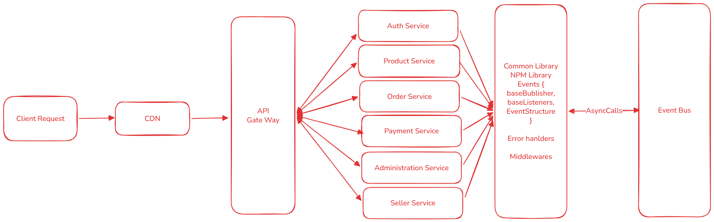

# Project Architecture - High Level Overview

## 1. Overview
This project is a **microservices-based backend system** designed for scalability, modularity, and maintainability. It follows best practices including **common shared libraries**, **environment-based configurations**, and **service-level load balancing**.  

Each service is **independently deployable**, horizontally scalable, and interacts with other services via APIs. Frontend assets may be served via **CDN** for better performance.

## 2. Architecture Diagram

**Legend:**  
- **API Gateway**: Optional, routes requests to services.  
- **LB (Load Balancer)**: Each service has its own load balancer distributing traffic across multiple instances.  
- **Database Replica**: Each service connects to its own database cluster for isolation and scalability.  
- **CDN**: Serves static frontend assets efficiently.  

---

## 3. Key Components

### 3.1 Common Library
- Handles **JWT authentication** and other shared utilities.  
- Reads **environment variables** for secrets and service configuration.  
- Shared across all services to avoid duplication.

### 3.2 Services
- Each service is **self-contained**:  
  - `User Service` – manages user accounts and authentication.  
  - `Product Service` – manages product catalog.  
  - `Cart Service` – manages shopping cart operations.  
- Each service can **scale independently** by running multiple instances.  
- Internal **load balancing** ensures traffic is distributed among instances.

### 3.3 Load Balancing
- **Service-level**: Each service has its own internal LB (Node cluster, Nginx, or Kubernetes service).  
- **System-level**: Optionally, an API Gateway or external load balancer can route requests to the appropriate service cluster.

### 3.4 Environment Variables
- Store **secrets, API keys, DB URLs**.  
- Each service reads only the variables it needs.  
- Common library enforces **centralized JWT secret management**.

### 3.5 CDN
- Optional but recommended for frontend static assets.  
- Reduces load on backend services and improves performance.

---

## 4. Deployment Notes
- Services can be deployed on **containers (Docker)** or **server instances**.  
- **Horizontal scaling** achieved by adding more instances behind the load balancer.  
- Database replication ensures **high availability**.  
- Use **CI/CD pipelines** for automated deployment and version control.

---

## 5. Future Enhancements
- Add **circuit breakers** or **rate limiting** per service for resilience.  
- Integrate **service discovery** for dynamic scaling.  
- Monitor services with **centralized logging** and **metrics dashboards**.  